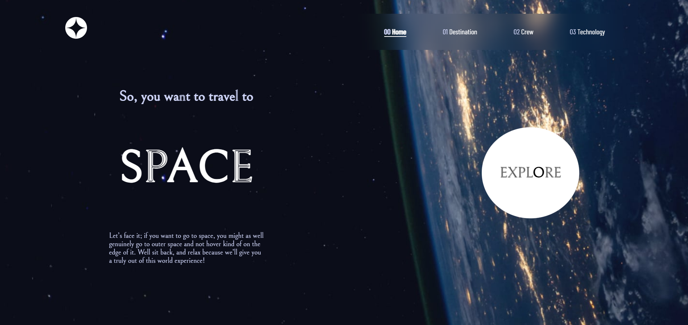

# Frontend Mentor - Space tourism website solution

This is a solution to the [Space tourism website challenge on Frontend Mentor](https://www.frontendmentor.io/challenges/space-tourism-multipage-website-gRWj1URZ3). Frontend Mentor challenges help you improve your coding skills by building realistic projects. 

## Table of contents

- [Overview](#overview)
  - [The challenge](#the-challenge)
  - [Screenshot](#screenshot)
  - [Links](#links)
- [My process](#my-process)
  - [Built with](#built-with)
  - [What I learned](#what-i-learned)
  - [Continued development](#continued-development)
  - [Useful resources](#useful-resources)
- [Author](#author)
- [Acknowledgments](#acknowledgments)


## Overview

### The challenge

Users should be able to:

- View the optimal layout for each of the website's pages depending on their device's screen size
- See hover states for all interactive elements on the page
- View each page and be able to toggle between the tabs to see new information

### Screenshot




### Links

- Solution URL: [Github](https://github.com/phellwege/SpaceTourism)
- Live Site URL: [GH-Pages](https://phellwege.github.io/SpaceTourism/)

## My process

### Built with

- Semantic HTML5 markup
- CSS custom properties
- Flexbox
- CSS Grid
- Mobile-first workflow
- [React](https://reactjs.org/) - JS library


### What I learned

Trying to use images from a json file was no small feat, and took a lot of time to figure out how it was being rendered in the build process

```js
const crew = require('../static/crew/'+ data.crew[index].images.webp + '.webp');

<div className='CrewWrap'>
                <div id='crewLeft'>
                    <h5>{data.crew[index].role}</h5>
                    <h3>{data.crew[index].name}</h3>
                    <p>{data.crew[index].bio}</p>
                    <div id='crewBtn'>
                        <button className={"carousel-button" + (index===0?" active-button":"")} onClick={() => {setIndex(0)}}></button>
                        <button className={"carousel-button" + (index===1?" active-button":"")} onClick={() => {setIndex(1)}}></button>
                        <button className={"carousel-button" + (index===2?" active-button":"")} onClick={() => {setIndex(2)}}></button>
                        <button className={"carousel-button" + (index===3?" active-button":"")} onClick={() => {setIndex(3)}}></button>
                    </div>
                </div>
                <div id='crewRight'>
                    
                </div>
            </div>
```


### Continued development

In the future I would implement a database instead of a JSON file. It would have actually been easier to build out a database and then have my images and information come from that instead of coming from the JSON.


## Author

- Website - [Peter Hellwege](http://peters-portfolio.net/)
- Frontend Mentor - [@phellwege](https://www.frontendmentor.io/profile/phellwege)


## Acknowledgments

A BIG thank you to my Senior [Darryl Kinzer](https://github.com/DarrylKilzer) for helping me to get the JSON to read properly.
